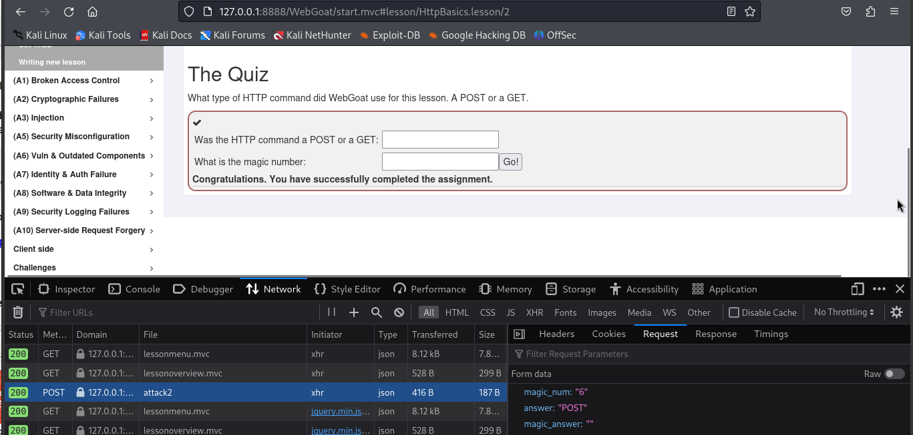

# Hacker Warmup 

Tehtävänannot luettavissa osoitteessa https://terokarvinen.com/2024/eettinen-hakkerointi-2024/

Raportissa käytetty laite Asus Vivobook X1505. Järjestelmän olennaiset tiedot:
````
OS: Debian 12 (Bookworm)
RAM: 16GB
CPU: 12th Gen Intel(R) Core(TM) i7-1255u (x86_64)
````


## X) Lue ja tiivistä

### Surveying essential tools for active recoinnassance | The art of hacking video collection

#### Understanding Active Recoinnassance
- Passiivisessa tiedustelussa ei aktiivisesti lähetetä paketteja kohdejärjestelmään
  - Ei näy lokeissa
- Aktiivisessa tiedustelussa järjestelmiin lähetetään paketteja esim. tekemällä portti- tai haavoittuvuusskannauksia
  - Toiminnot nähtävissä lokeista
- Skannauksia vähitellen lisäämällä pääteltävissä, aiheuttaako tiedustelu toimenpiteitä tai hälytyksiä hyökkäyksen kohteena olevassa järjestelmässä

#### Exploring Active Recoinnassance Methodologies from an Ethical Hacker Perspective
- Järjestelmällisyys tutkinnassa on tärkeää
  - Rajallinen aikataulu
  - Kohteiden ja haavoittuvuuksien valinta
- Tiedustelun jälkeen tulisi olla hyvä kuva siitä, mihin järjestelmiin ja palveluihin hyökkäyksensä kohdistaa
- Kolme testiä:
  - Porttiskannaukset: varmistetaan passiivisessa tiedustelussa havaittujen avointen porttien lisäksi muut avoimet portit porttiskannereita käyttäen
  - Web Service Review: tutkitaan, mitä web-applikaatioita järjestelmässä on käytössä ja valitaan, mihin niistä hyökkäys kohdistetaan
  - Haavoittuvuusskannaus: tiedustelun viimeinen ja tärkeä vaihe. Aiheuttaa todennäköisimmin hälytyksiä kohdejärjestelmässä. Ei kannata tehdä ennen muita testejä.
 
#### Port Scanning and Web Service Review
- Porttiskannereita:
  - Nmap (https://nmap.org): monipuolisin porttiskanneri. Vakaa. Porttiskannaukset, palvelu- ja käyttöjärjestelmätunnistus, haavoittuvuusskannaukset.
    - Käyttö: ``$ nmap [asetukset] [kohde]``, esim. ``$ nmap -sS -vv -T4 -A ip-osoite``.
      - ``-sS``: TCP-send skannaus (half-open connection). Palvelimen avoimien porttien ilmoituksiin ei lähetetä vastauksia.
      - ``-vv``: Verbose, tulostaa skannauksen tietoja
      - ``-T4``: Nopeuttaa skannsusta
      - ``-A``: Lisäominaisuuksia: skriptejä, käyttöjärjestelmän ja versioiden tunnistus
      - ``-Pn``: Suositeltava käytettäväksi internetistä skannatessa. Ilman tätä asetusta skannaukset jäävät suurelta osin palomuuriin.
      - ``-p1-65535``: skannattavien porttien valinta. Tietty portti tai useita portteja.
  - Masscan (https://github.com/robertdavidgraham/masscan.git): Nopein porttiskanneri. Mahdollistaa tietyn portin skannaamisen koko Internetistä. Ei yhtä monipuolinen kuin nmap, mutta nopeampi suurien verkkojen skannaamiseen.
    - Käyttö:
      - ``$ masscan [asetukset] [kohde] --rate=[pakettien määrä/s]``. Esim ``$ masscan -p80,443 192.168.1.0/24 --rate=10000``
        - ``-p80,443``: skannattavat portit
        - ``192.168.1.0/24``: skannattavan verkon osoite
        - ``--rate=10000``: pakettien määrä/s
  - Udpprotoscanner(https://github.com/portcullislabs/udp-proto-scanner.git): UDP-porttiskanneri. Yleensä porttiskannerit keskittyvät TCP-protokollaan, mutta Udpprotoscannerilla voi skannata verkon UDP-portit nopeasti.
    - Käyttö:
      - ``$ ./udp-proto-scanner.pl [verkon ip-osoite]`` - Skannaa verkon avoimet UDP-portit

- Web Service Review -työkaluja:
  - EyeWitness(https://github.com/ChrisTruncer/EyeWitness): Suositeltu työkalu. Etsii verkosta kaikki web-sivut kuvankaappauksineen ja lisätiedoilla.
    - Käyttö:
      - Ensin porttiskannaus esim. nmapilla (http/https-portit)
      - ``$ ./EyeWitness.py --web -f ip_list.txt``
        - ``--web``: skannataan järjestelmiä porteista 80 ja 443
        - ``-f ip_list.txt``: kohdeosoitteet tiedostosta
       
#### Network and Web Vulnerability Scanners
- Verkon haavoittuvuusskannaukseen:
  - OpenVAS (open source)
  - Nessus
  - Nexpose
  - Qualys
  - Nmap (rajalliset ominaisuudet, pääosin porttiskanneri)
    - Esimerkkikäyttö: ``$ nmap -SC smb-vuln-ms17-010 192.168.1.2``
      - ``-SC``: Script scan + skriptin nimi. Skriptit löytyvät /usr/share/nmap/-hakemistosta. Listattu myös (https://nmap.org/nsedoc/scripts/)
 
- Web-haavoittuvuusskannerit:
  - Nikto: Helppokäyttöinen, yleinen
  - WPScan: WordPress-pohjaisille sivuille
  - SQLMap: Tietokannat, SQL-injektiot
  - Burp Suite: Web-applikaatioiden suosituimpia skannereita. Toimii myös proxynä.
  - Zed Attack Proxy (OWASP ZAP): Ilmainen, vastaava kuin Burp Suite.
  

Lähde: [Surveying Essential Tools for Active Recoinnassance](https://learning.oreilly.com/videos/the-art-of/9780135767849/9780135767849-SPTT_04_00). Katsottu 30.3.2024.

### Hutchins et al 2011: Intelligence-Driven Computer Network Defense Informed by Analysis of Adversary Campaigns and Intrusion Kill Chains
 
 - APT: Advanced Persistent Threat. Tiettyjen alojen suurin tietoturvauhka, jonka tarkoituksena on hyötyä varastetusta datasta taloudellisesti tai sotilaallisesti. 


Lähde: [https://lockheedmartin.com/content/dam/lockheed-martin/rms/documents/cyber/LM-White-Paper-Intel-Driven-Defense.pdf](https://lockheedmartin.com/content/dam/lockheed-martin/rms/documents/cyber/LM-White-Paper-Intel-Driven-Defense.pdf). Luettu 5.4.2024

## A) Over the Wire: Bandit

[Over the Wire](https://overthewire.org/wargames/) on sivusto, jonka kautta voi pelillisesti harjoitella tietoturvan eri osa-alueita. Bandit on peleistä helpoin ja se on suunnattu vasta-alkajille.

### Level 0
Tason tehtävänä on ottaa SSH-yhteys bandit.labs.overthewire.org-palveluun portista 2220. Käyttäjätunnus ja salasana ovat bandit0:bandit0.

Aloitin tehtävän avaamalla terminaalin. Otin yhteyden palvelimeen komennolla ``$ ssh bandit0@bandit.labs.overthewire.org -p 2220``. ``ssh``-komentoa käytetään salatun SSH-yhteyden muodostamiseen, bandit0@bandit.labs.overthewire.org on palvelimen osoite ja käytettävä käyttäjätunnus, ja käytettävä portti määritetään ``-p 2220``-asetuksella. Annoin salasanaksi palvelimen sitä kysyessä bandit0, minkä jälkeen pääsin sisälle. Tehtävä ratkaistu!

### Level 0 -> 1
Tason tehtävänä oli etsiä seuraavan tason salasana kotihakemistossa sijaitsevasta tiedostosta readme, ja käyttää tätä seuraavalle tasolle kirjautuessa.

Listasin hakemiston tiedostot komennolla ``$ ls``. minkä jälkeen tulostin hakemistosta löytyvän readme-tiedoston sisällön komennolla ``$ cat readme``. Kopioin tiedostossa olevan salasanan maalaamalla sen kursorilla, minkä jälkeen kirjauduin ulos palvelimelta komennolla ``$ logout`` voidakseni muodostaa seuraavalle tasolle SSH-yhteyden komennolla ``$ ssh bandit1@bandit.labs.overthewire.org -p 2220``. Salasanaa kysyttäessä annoin kopioimani salasanan klikkaamalla terminaalin ikkunaa hiiren oikealla painikkeella. Kirjautuminen onnistui, ja taso oli suoritettu!


>Bandit0

### Level 1 -> 2
Tason tehtävänä oli lukea salasana tiedostosta '-'. 

Otin edellisen tehtävän tapaan yhteyden palvelimelle tunnuksella bandit2. Tiedosto löytyi kotihakemistosta komennolla ``$ ls``. Komentorivin komennoille annetaan usein lisäargumentteja käyttämällä etuliitteenä merkkiä '-', joten tiedostoa ei voi avata suoraan komennolla ``$ cat -``. Ajattelin vaihtoehtoisia tapoja olevan tulostaa koko hakemiston kaikki tiedostot (``$ cat ./*``), tai käyttää '-merkkejä tiedostonimen ympärillä ``$ cat '-'``. Ensimmäinen yritys toimi, toinen ei. Painoin päällimmäisen prosessin tappavaa pikakomentoa ctrl+c, ja koitin uutta lähestymistapaa. Muokkasin jälkimmäistä komentoa käyttämään tiedoston koko polkua komennolla ``$ cat ./-``. "." on pikakomento nykyiselle hakemistolle. Salasana tulostui ja oli käytettävissä seuraavalle tasoille siirtymiseen. 


>Bandit1

### Level 2 -> 3
Tason tehtävänä oli lukea salasana tiedostosta 'spaces in this filename'.

Katkaisin ensin edellisen tehtävän ssh-yhteyden komennolla ``$ logout``, minkä jälkeen otin yhteyden seuraavalle tasolle tunnuksella bandit2 ja annoin edellisestä tehtävästä löytämäni salasanan palvelimen sitä kysyessä. Edellisen tehtävän ratkaisu ``$ cat ./*`` toimi suoraa tässäkin, ja myös toinen lähestymistapa tiedoston nimeä käyttämällä toimi siten, että käytin TAB-näppäintä täydentämään tiedoston nimen. Tämä lisäsi automaattisesti välilyöntien väleihin escapeina käytettävät \\-merkit, ja tiedoston sisältö tulostui.


>Bandit2

## B) WebGoatin asennus

Tein tehtävät alkuperäisestä järjestyksestä poiketen siten, että asensin ensin E)-kohdan mukaisesti virtuaalikoneen, jossa ajattelin WebGoatia pyörittää. 

Seurasin tehtävänantoon linkattua WebGoatin [asennusohjetta](https://terokarvinen.com/2020/install-webgoat-web-pentest-practice-target/). Avasin virtuaalikoneen terminaalin, päivitin paketinhallinnan listat ``$ sudo apt-get update`` ja latasin WebGoatin lataamiseen ja pyörittämiseen tarvittavat paketit ``$ sudo apt-get -y install openjdk-17-jre ufw wget bash-completion``. 

Kytkin palomuurin päälle komennolla ``$ sudo ufw enable``, ja latasin WebGoatin ``$ wget https://github.com/WebGoat/WebGoat/releases/download/v2023.4/webgoat-2023.4.jar``, minkä jälkeen käynnistin sen komennolla ``$ java -Dfile.encoding=UTF-8 -Dwebgoat.port=8888 -Dwebwolf.port=9090 -jar webgoat-2023.4.jar``, joka ajaa Javalla webgoat-2023.4.jar-tiedoston. Ylimääräisenä määritellään, että WebGoat kuuntelee porttia 8888 ja WebWolf porttia 9090. Encoding oletettavasti määrittelee käytettävän merkistön, joka tässä tapauksessa on UTF-8. 

Siirryin selaimella osoitteeseen localhost:8888/webgoat/. Palvelu oli päällä ja onnistuin luomaan tunnukset 'Register new user'-ominaisuuden kautta.


>WebGoat käynnissä ja tunnukset luotu

Lähde: https://terokarvinen.com/2020/install-webgoat-web-pentest-practice-target/. Luettu 6.4.2024. 

## C) WebGoat HTTP Basics & Developer tools

### HTTP Basics

Tässä tehtävässä kerrottiin ensin, miten HTTP toimii. Client (kuten web-selain) lähettää palvelimelle kutsuja(request), joihin palvelin vastaa(response). Molemmat koostuvat kolmesta osasta: request- tai response-rivi, header ja body. Clientin pyyntöjä on kahdenlaisia: GET ja POST. GET pyytää mahdollisilla lisäparametreilla palvelimelta dokumentteja. POST lähettää käyttäjän syöttämää dataa palvelimelle. 

Varsinainen tehtävä oli vastata kysymykseen, onko lomakkeelta lähtevä nimitieto GET- vai POST-tyyppinen, ja antaa jokin taikanumero. Koska lomakkeelta lähetetään käyttäjän syöttämää dataa, oli kyseessä POST. Taikanumeroa jäin hetkeksi ihmettelemään, ja ajattelin sen kulkevan jossain request- tai responseviesteissä. Avasin selaimen developer-tilan painamalla F12 ja etsin verkkoliikenteen välilehden. Lähetin lomakkeen uudelleen ja avasin tarkempaa tutkiskelua varten POST-kutsun tiedot painamalla kyseistä riviä. Eri välilehtiä kaivelemalla löysin kohdan, josta magic number löytyi, ja koitin syöttää sen lomakkeelle. 


>Tehtävä suoritettu!

### Developer Tools

Ennakkotietona tehtävässä esiteltiin developer-tilan käyttöä. Sinänsä nurinkurinen järjestys, koska niitä tarvittiin jo ensimmäisessä tehtävässä. 

Developer tools -välilehdet:
 - Elements: HTML- ja CSS-lähdekoodit
 - Console: javascript-tulosteita
 - Sources: kaikki sivun luomiseen käytetyt HTML-, CSS- ja JavaScript-tiedostot

Ensimmäisessä tehtävässä piti kutsua konsolin kautta funktiota webgoat.customjs.phoneHome(). Avasin developer-tilan painamalla F12, menin console-välilehdelle ja kutsuin funktiota kirjoittamalla ``webgoat.customjs.phoneHome()`` ja painamalla enter. Funktio palautti satunnaisluvun, jonka syöttämällä HTML-lomakkeelle tehtävä oli suoritettu.


>Kotiin soiteltu!

Toisessa tehtävässä piti lähettää kutsu painamalla lomakkeen näppäintä ja etsiä network-välilehdeltä kutsulle muodostunut satunnaisluku. Avasin developer-tilan network-välilehden, lähetin kutsun painamalla lomakkeen nappia ja löysin kaipaamani satunnaisluvun kyseisen kutsun request-välilehdeltä. Tämän syöttäminen lomakkeelle toimi tehtävän ratkaisuna. 


>Satunnaislukua lomakkeelta

## D) PortSwigger

Loin PortSwiggeriin tunnukset ja 

Sivulla oleva SQL-kysely oli tehtävänannon mukaan tällainen: ``SELECT * FROM products WHERE category = 'Gifts' AND released = 1``. Tarkoituksena oli saada SQL-injektion avulla sivu näyttämään myös julkaisemattomat tuotteet (released = 0). Category määriteltiin suoraan URL:ssa, esimerkiksi Gifts-kategorian tuotteet listaava URL oli web-security-academy.net/filter?category=Gifts.

Kysely osiin pilkottuna:
 - SELECT * FROM products: valitaan kaikki tietokannan products-taulun arvot
 - WHERE category = 'Gifts': .. joiden category-kentän arvo on Gifts. Injektio tulee tehdä tähän väliin, koska se määritellään URL:ssa.
 - AND released = 1: .. ja joiden released-kentän arvo on 1. Tämä tulee saada kommentoitua pois kyselystä.

Syöte tuli saada muokattua sellaiseen muotoon, että se on SQL:n syntaksin mukaista, mutta paljastaa myös julkaisemattomat tuotteet. Tämä onnistuisi esimerkiksi muokkaamalla kysely seuraavanlaiseksi: ``SELECT * FROM products WHERE category = 'Gifts' OR released = 0 --' AND released = 1``. Tällöin syötteenä käytettäisiin arvoa ``Gifts' OR released = 0 --``. Kysely etsii tuotteet, joiden kategoria on Gifts tai mitä tahansa tuotetta, jonka released-arvo on 0. Lopun ``--`` ovat SQL:n kommenttimerkkejä, joilla estetään kyselyn lopun ``released = 1``-ehdon tarkistus. 

Testasin avaamalla harjoituksen verkkokaupan Gifts-kategorian ja muokkasin sen jälkeen URL:n seuraavanlaiseksi: ``web-security-academy.net/filter?category=Gifts' or released = 0 --``. Toimi!


> Onnistunut injektio


## E) Linux virtuaalikoneeseen

Olen aiemmin virtualisoinut koneita VirtualBoxilla. Aloitin testaamalla, onko VBox asennettu isäntäkäyttöjärjestelmään terminaalin kautta komennolla ``$ virtualbox``, jonka tulisi käynnistää VirtualBox. Ohjelma käynnistyi ja tarkastin käytössä olevan version Help -> About VirtualBox. Käytössä oli versio 7.0.12. Seuraavaksi latasin tehtävänannossa suositellun Kali Linuxin tuoreimman isäntälaitteen prosessoriarkkitehtuurille sopivan version [Kali Linux 2024.1 AMD64](https://cdimage.kali.org/kali-2024.1/kali-linux-2024.1-installer-amd64.iso).

### Uuden virtuaalikoneen luominen VirtualBoxilla

Työvaiheet:
 - Klikkasin VirtualBoxin ikkunasta "New"
 - Name and Operating System:
   - Etsin kohdasta ISO Image asennuksessa käytettävän aiemmin lataamani Kalin levykuvan
     - VirtualBox tunnisti levykuvan perusteella käyttöjärjestelmän tyypiksi Debian 64-bit. Vaihdoin tähän alasvetolistasta Other Linux 64-bit.
 - Hardware:
   - Base Memory: 4096 MB
   - Processors: 4
 - Hard Disk:
   - Create a Virtual Hard Disk Now. Koko 20 GB.
 - Finish


> Virtuaalikoneen perustiedot VirtualBoxin pääikkunassa

### Kalin asennus virtuaalikoneeseen

Käynnistin virtuaalikoneen VirtualBoxin napista 'Start', ja kone käynnistyi Kalin asennusmediaan. Valitsin Graphical Install, koska oletin sen olevan kätevin tapa asentaa käyttöjärjestelmä.

#### Asennuksessa tehtyjä valintoja

 - Language: English
 - Location: Other -> Europe -> Finland
 - Configure locales: United Kingdom - en_GB.UTF-8 (vaikuttaa muistaakseni esimerkiksi desimaalien ja päivämäärien merkintätapaan. Tässä koneesssa ei juuri merkitystä)
 - Keyboard: Finnish

Tässä vaiheessa noin minuutti odottelua asennusohjelman tunnistaessa automaattisesti mm. verkkoasetuksia.

 - Hostname: kali-vm
 - Configure the network: Tyhjä. Ei domainia käytössä.

Seuraavaksi annoin käyttäjätietoihin oman nimeni, haluamani käyttäjätunnuksen ja salasanan. 

 - Partition disks: 
   - Guided - use entire disk (ei ollut tarvetta jakaa pienempiin osiin, sillä virtuaalikoneen kovalevytila valittu vain pientä puuhastelua varten.)
   - All files in one partition (asennusohjelman suosittelema vaihtoehto uusille käyttäjille)
   - Finish partitioning and write changes to disk. Tämän jälkeen aukesi yhteenveto tehtävistä muutoksista levyn osiointiin. Varmistusta kysellessä painoin Yes -> Continue.

Asennusohjelman kopioi tiedostoja pari minuuttia ja kyseli, millaisia kustomointeja haluaisin tehdä asennettaviin paketeihin ja graafiseen käyttöliittymään. Etenin vakiovaihtoehdoilla, jotka asennusohjelma tämän jälkeen latasi ja asensi valmiiksi. Tässä kesti kymmenisen minuuttia.


>Valitut työkalupaketit ja käyttöliittymä

Lopuksi asennusohjelma kysyi asennetaanko GRUB boot loader. Kyseessä on virtuaalikoneen ainoa käyttöjärjestelmä, joten asennuksella ei käsittääkseni pitäisi olla haittavaikutuksia. Valitsin Yes -> Continue, ja tämän jälkeen valitsin boot loaderin asennettavan aiemmin asennuksessa luomalleni partitiolle. Tämän jälkeen asennus oli valmis, ja uudelleenkäynnistyksen jälkeen virtuaalikone boottasi Kaliin. Kirjautuminen onnistui aiemmin määritetyllä käyttäjätunnus ja salasana -yhdistelmällä.


>Kali asennettu, käy ja kukkuu.

## F) Localhost TCP-porttiskannaus

Tein porttiskannaukset nmapilla, sillä sain ensimmäisen tehtävän videioista käsityksen, että se olisi parhaimpia työkaluja tarkoitukseen. Aloitin tarkastamalla, oliko virtuaalikoneeseen asennettu nmap ajamalla terminaalissa komennon ``$ nmap``. Tämä tulosti nmapin käyttöohjeita, eli paketti oli jo valmiiksi asennettuna Kalissa.

Tehtävänä oli skannata 1000 yleisintä TCP-porttia, joten tutustuin nmapin ohjeisiin manpagesin kautta ``$ man nmap``. Löysin asetuksen ``--top-ports [numero]``, jolla voidaan määrittää montako yleisintä porttia skannataan. Testasin sitä, komento ja tulokset alla:

````
$ nmap --top-ports 1000 localhost     
Starting Nmap 7.94SVN ( https://nmap.org ) at 2024-04-06 22:29 EEST # skannauksen aloittamisen aikaleima. 6.4.2024 klo 22:29 itäisen Euroopan aikaa
Nmap scan report for localhost (127.0.0.1) # Skannauksen kohde
Host is up (0.000074s latency). # Kohde vastaa, viive 0.000074 sekuntia
Other addresses for localhost (not scanned): ::1 # Epäselvää tässä tapauksessa. Muita osoitteita localhostille ei ilmeisesti löydetty, joten niitä ei skannattu.
All 1000 scanned ports on localhost (127.0.0.1) are in ignored states. # Mikään 1000 yleisimmästä portista ei vastaa. Palveluita ei pyöri porteissa.
Not shown: 1000 closed tcp ports (conn-refused) # Listaamattomat portit. Tässä tapauksessa kaikki skannatut. 

Nmap done: 1 IP address (1 host up) scanned in 0.03 seconds # Skannaus yhteen osoitteeseen suoritettu 0.03 sekunnissa
````
Lähde: Manpages / nmap (``$ man nmap``)


## G) Localhost TCP-porttiskannaus / kaikki portit

Tutustuin jälleen nmapin ohjeisiin ``$ man nmap``-komennolla ja etsin, miten voin skannata kaikki portit. Skannattavien porttien väli olisi määritettävissä asetuksella -p[alku]-[loppu]. Kaikki portit skannattaisiin siis komennolla ``$ nmap -p1-65535 localhost``. Tulokset olivat hyvin vastaavat, kuin edellisessäkin tehtävässä, ainoiden erojen ollessa skannattujen porttien määrä ja skannauksen kesto. 

````
$ nmap -p1-65535 localhost    
Starting Nmap 7.94SVN ( https://nmap.org ) at 2024-04-06 22:38 EEST
Nmap scan report for localhost (127.0.0.1)
Host is up (0.000052s latency).
Other addresses for localhost (not scanned): ::1
All 65535 scanned ports on localhost (127.0.0.1) are in ignored states.
Not shown: 65535 closed tcp ports (conn-refused)

Nmap done: 1 IP address (1 host up) scanned in 0.79 seconds
````
Lähde: Manpages / nmap (``$ man nmap``)

## H) Laaja porttiskannaus

Nmapissa voidaan suorittaa laajempi porttiskannaus käyttämällä -A -asetusta. Tällöin nmap tekee skannaa myös käyttöjärjestelmiä ja ohjelmistoversioita, skriptejä, sekä suorittaa avoimiin portteihin reitin määrityksen tracerouten avulla. 

Testasin kaikkien porttien skannausta -A-asetuksella. Yksikään portti ei edelleenkään vastannut, joten tulokset olivat liki identtiset edellisten tehtävien kanssa.

````
$ nmap -A -p1-65535 localhost
Starting Nmap 7.94SVN ( https://nmap.org ) at 2024-04-06 22:43 EEST
Nmap scan report for localhost (127.0.0.1)
Host is up (0.000062s latency).
Other addresses for localhost (not scanned): ::1
All 65535 scanned ports on localhost (127.0.0.1) are in ignored states.
Not shown: 65535 closed tcp ports (conn-refused)

Service detection performed. Please report any incorrect results at https://nmap.org/submit/ . # Maininta siitä, että -A:ta käytetty.
Nmap done: 1 IP address (1 host up) scanned in 1.98 seconds
````


## Lähteet

[Terokarvinen.com - Tunkeutumistestaus 2024](https://terokarvinen.com/2024/eettinen-hakkerointi-2024/). Luettu 30.3.

[Surveying Essential Tools for Active Recoinnassance](https://learning.oreilly.com/videos/the-art-of/9780135767849/9780135767849-SPTT_04_00). Katsottu 30.3.

[Hutchins et al 2011: Intelligence-Driven Computer Network Defense Informed by Analysis of Adversary Campaigns and Intrusion Kill Chains](https://lockheedmartin.com/content/dam/lockheed-martin/rms/documents/cyber/LM-White-Paper-Intel-Driven-Defense.pdf). Luettu 5.4.2024
